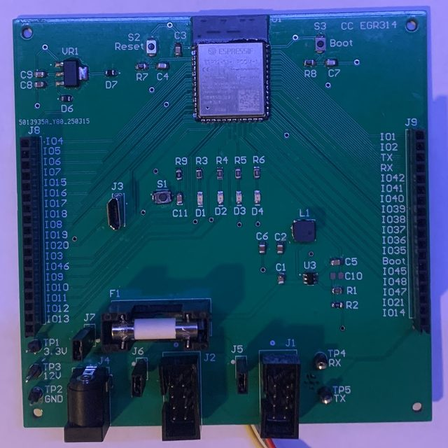
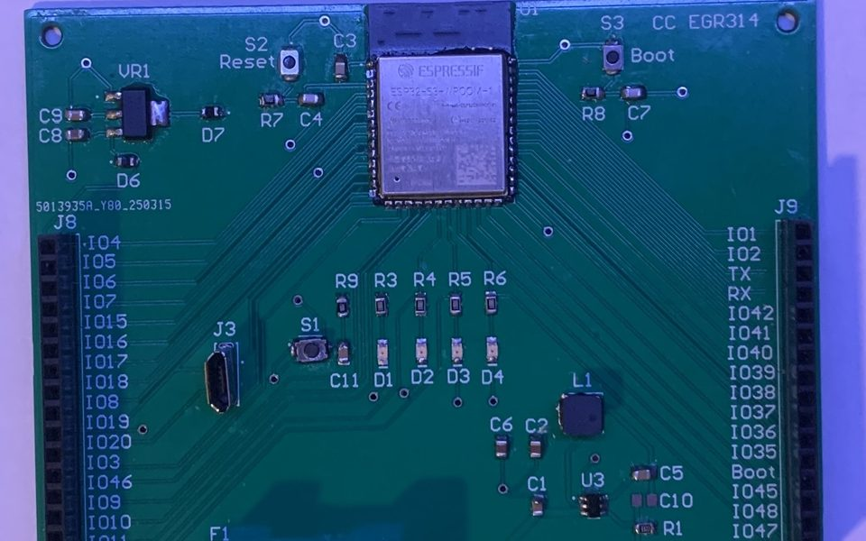
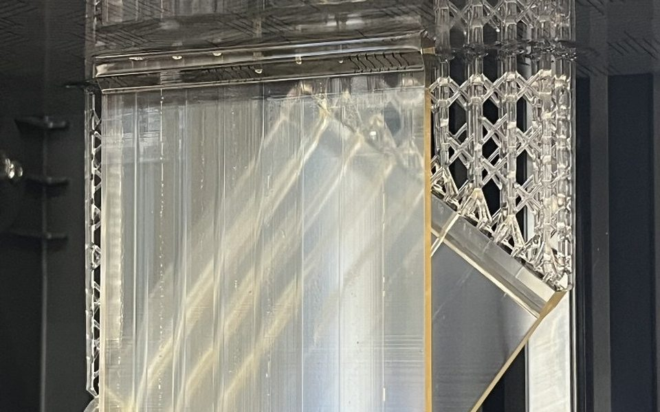

<section class="hero" markdown>

Open to internships &amp; full-time roles

# Cade Clonts

Electrical engineer: embedded hardware, power electronics, and controls

I build things that have to work in the real world: boards that survive being plugged in wrong, control loops that behave when the input is noisy, and power systems sized with actual margin. Most of my projects start on a bench and end with a fabricated board, a running system, and a list of what I'd change in the next revision.

[View projects](projects/index.md){ .md-button .md-button--primary }
[Resume](resume.md){ .md-button }
[:fontawesome-brands-github: GitHub](https://github.com/Skyworrio){ .md-button }

<ul class="hero__facts" markdown>
<li markdown>:material-school-outline: Arizona State University · M.S. expected 2027</li>
<li markdown>:material-map-marker-outline: Phoenix, Arizona</li>
<li markdown>:material-lightning-bolt-outline: Power · Controls · Defense electronics</li>
</ul>

<!-- TODO: swap this for a headshot (docs/assets/headshot.jpg) if you'd like a photo here -->

  

</section>

## Featured projects

[All projects :material-arrow-right:](projects/index.md)

  <a class="project-card" href="projects/wifi-mqtt-board/">
    

    

      Hardware + firmware · Spring 2025
      <h3 class="project-card__title">ESP32 Wi-Fi / MQTT Gateway Board</h3>
      
Custom ESP32-S3 board with dual 3.3 V rails, a framed UART protocol for a daisy-chained multi-board network, and TLS MQTT firmware. Fabricated, assembled, and demoed at the ASU Innovation Showcase.

      <ul class="tags"><li>Altium</li><li>ESP32-S3</li><li>MicroPython</li><li>Power design</li><li>MQTT / TLS</li></ul>
      Read case study →
    

  </a>
  <a class="project-card" href="projects/capillary-wicks/">
    

    

      Research · 2025 – present
      <h3 class="project-card__title">Additively Manufactured Capillary Wicks</h3>
      
Do branching channel networks designed to Murray's Law or da Vinci's rule move liquid better? Printed by MSLA and flow-tested for passive heat-pipe wicks in ASU's 3DX Research Group.

      <ul class="tags"><li>MSLA printing</li><li>Design of experiments</li><li>Fluid physics</li><li>Microscopy</li></ul>
      Read case study →
    

  </a>

## What I work with

:material-chip:<h3>PCB &amp; hardware design</h3>

<ul class="tags"><li>Altium Designer</li><li>KiCad</li><li>SMT assembly &amp; rework</li><li>Board bring-up</li><li>Buck / LDO rails</li><li>BOM &amp; sourcing</li></ul>

:material-code-braces:<h3>Embedded firmware</h3>

<ul class="tags"><li>ESP32 (MicroPython, ESP-IDF)</li><li>PIC (MPLAB / MCC)</li><li>UART · I2C · SPI</li><li>MQTT over TLS</li><li>Async event loops</li></ul>

:material-lightning-bolt:<h3>Power &amp; energy</h3>

<ul class="tags"><li>Converter design &amp; loss analysis</li><li>Battery management</li><li>Microgrid modeling (Xendee)</li><li>PV system design</li></ul>

:material-chart-bell-curve-cumulative:<h3>Controls &amp; modeling</h3>

<ul class="tags"><li>MATLAB / Simulink</li><li>Digital filter design</li><li>Vehicle dynamics simulation</li><li>ROS</li></ul>

:material-printer-3d-nozzle:<h3>Fabrication</h3>

<ul class="tags"><li>FDM &amp; MSLA 3D printing</li><li>CAD / enclosure design</li><li>Sheet-metal fabrication</li><li>Hand &amp; shop tools</li></ul>

## About

I hold a B.S. in Electrical Systems Engineering from Arizona State University and am finishing an accelerated M.S. there (expected Spring 2027), with graduate coursework in power electronic converters, applied photovoltaics, and multimodal ML for engineering applications. Outside of class I do undergraduate research in ASU's 3DX Research Group on additively manufactured structures for passive thermal management.

My interests sit at the intersection of **power and energy**, **controls and automation**, and **defense electronics**, and I'm looking for internship or full-time roles in those areas.

## Let's talk

Hiring for power, controls, or embedded hardware roles? I'd be glad to walk through any of these projects in more detail.

<!-- TODO: once you add your email/LinkedIn in mkdocs.yml, add buttons here too, e.g.
[:fontawesome-solid-envelope: Email me](mailto:you@example.com){ .md-button .md-button--primary }
-->
[Resume](resume.md){ .md-button .md-button--primary }
[:fontawesome-brands-github: GitHub](https://github.com/Skyworrio){ .md-button }

