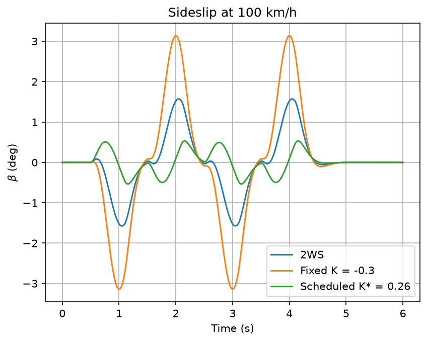
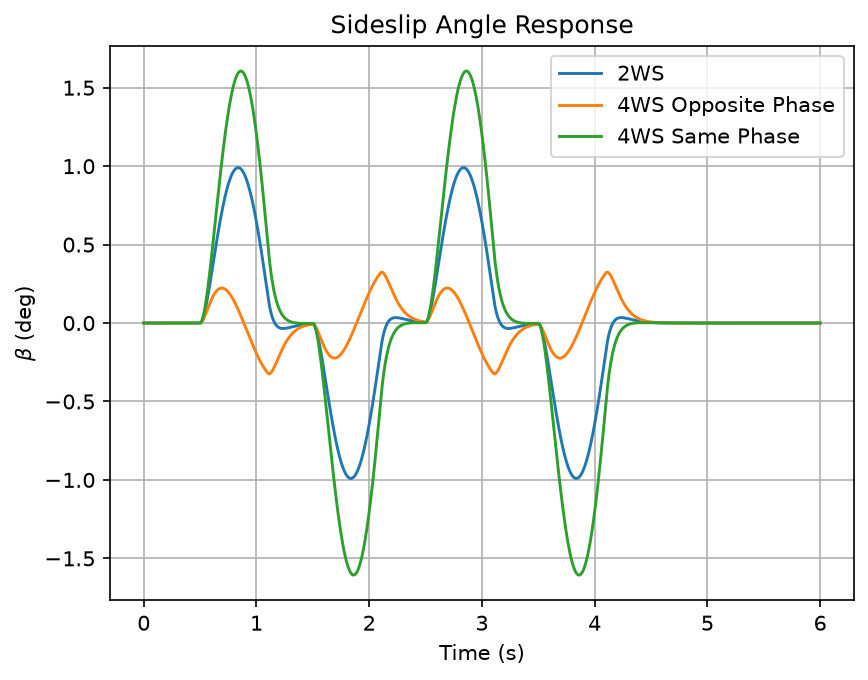
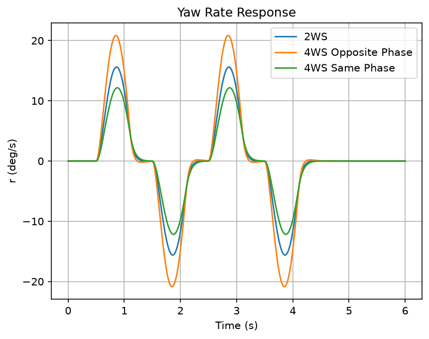
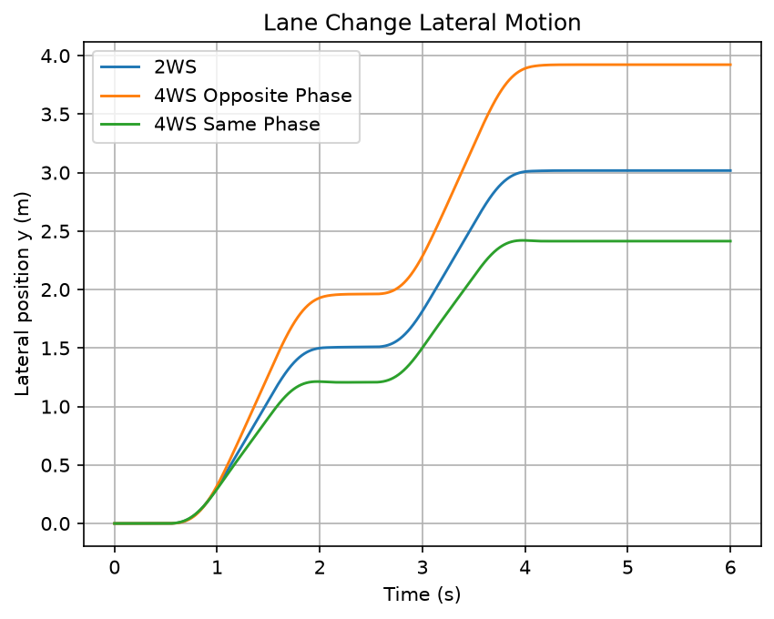
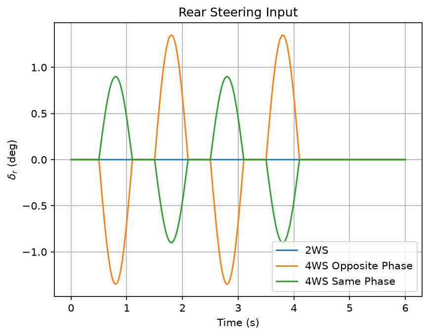
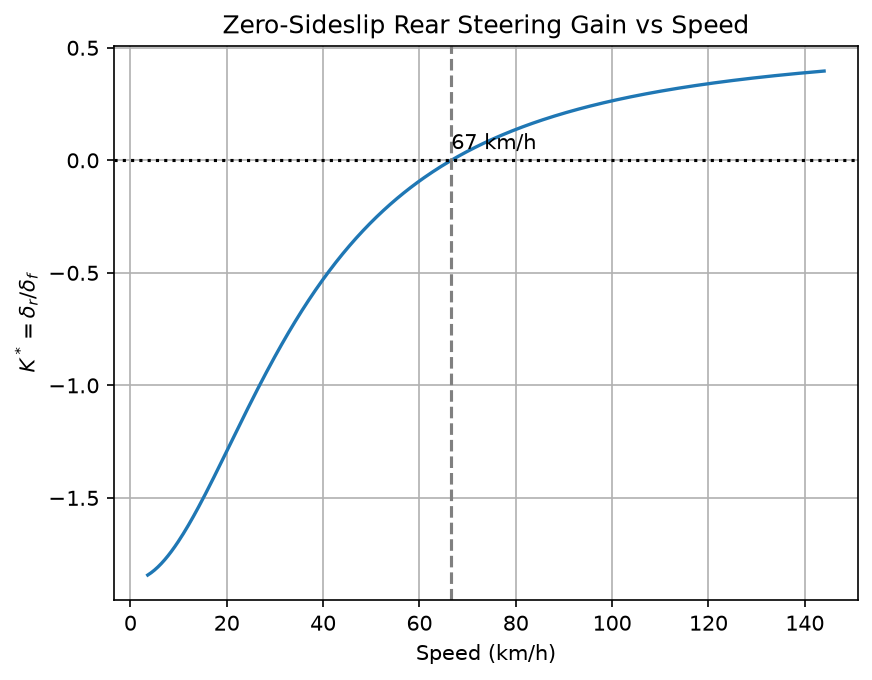
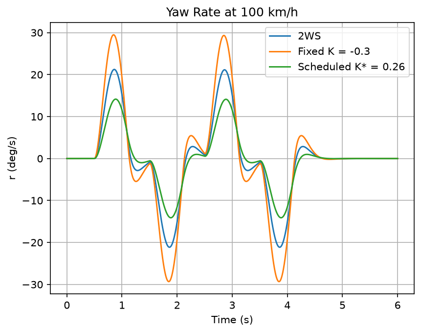

[:material-arrow-left: All projects](../index.md){ .back-link }

# Four-Wheel Steering Vehicle Dynamics

How much should a car's rear wheels steer, in which direction, and how should that change with speed?

A linear bicycle model of a four-wheel-steering (4WS) car, simulated through a double lane change to compare front-only steering against rear wheels steering opposite to or with the front. The headline result: the rear-steer gain that works best in town **doubles** sideslip on the highway, and scheduling the gain with speed fixes both.

| | |
|---|---|
| **Role** | Vehicle model and simulation script; analysis of steering modes |
| **Team** | 2 people |
| **When** | Spring 2026 · ASU EGR 560 Vehicle Dynamics & Control |
| **Tools** | MATLAB (`ode45`), Python (NumPy, SciPy, Matplotlib); Simulink + CarSim for the course's nonlinear co-simulation |
| **Files** | [MATLAB + Python simulation (zip)](files/4ws-vehicle-dynamics.zip) |

## The problem

With only the front wheels steering, a car's tuning is a compromise: nimble in town usually means twitchy on the highway, and stable on the highway usually means sluggish in a parking lot. Steering the rear wheels adds a second input:

- **Opposite phase** (rear wheels turn against the front): tighter turns, quicker yaw response.
- **Same phase** (rear wheels turn with the front): the car moves sideways with less rotation, which damps yaw at speed.

## The model

A 2-DOF linear bicycle model. States are sideslip angle $\beta$ and yaw rate $r$; inputs are front and rear steer angles. Assumptions: constant speed, small slip angles (linear tires), no roll or pitch.

$$\dot\beta = -\frac{C_f + C_r}{mV_x}\beta + \left(\frac{C_r l_r - C_f l_f}{mV_x^2} - 1\right) r + \frac{C_f}{mV_x}\delta_f + \frac{C_r}{mV_x}\delta_r$$

$$\dot r = \frac{C_r l_r - C_f l_f}{I_z}\beta - \frac{C_f l_f^2 + C_r l_r^2}{I_z V_x} r + \frac{C_f l_f}{I_z}\delta_f - \frac{C_r l_r}{I_z}\delta_r$$

Rear steering is proportional to front steering, $\delta_r = K\,\delta_f$, where $K<0$ is opposite phase and $K>0$ is same phase. Every case gets the same input: a double lane change made of four 4.5° half-sine steering pulses. Vehicle: 1270 kg, $I_z$ = 1536.7 kg·m², $l_f$ / $l_r$ = 1.015 / 1.895 m, $C_f = C_r$ = 80 kN/rad.

## Result 1: at 50 km/h, opposite phase wins

| Case | Peak sideslip | Peak yaw rate | Lateral offset |
|---|---|---|---|
| 2WS ($K=0$) | 1.0° | 15.6 °/s | 3.0 m |
| Opposite phase ($K=-0.3$) | **0.3°** | **20.9 °/s (+34%)** | 3.9 m |
| Same phase ($K=+0.2$) | 1.6° | 12.2 °/s (−22%) | 2.4 m |

At city speed, opposite-phase steering cuts peak sideslip by about 70% and sharpens yaw response by about a third. The car turns more and slides less.

## Result 2: the same gain is wrong on the highway

Setting $\dot\beta = \dot r = 0$ with $\beta = 0$ gives the rear-steer gain that zeroes steady-state sideslip at any speed:

$$K^*(V) = -\,\frac{l_r - \dfrac{m\,l_f\,V^2}{C_r L}}{l_f + \dfrac{m\,l_r\,V^2}{C_f L}}, \qquad L = l_f + l_r$$

For this car, $K^* \approx -0.28$ at 50 km/h, which is almost exactly the $-0.3$ that worked well above. But $K^*$ crosses zero at **about 67 km/h**, and above that the rear wheels need to steer *with* the front.

| At 100 km/h | Peak sideslip | Peak yaw rate |
|---|---|---|
| 2WS | 1.6° | 21 °/s |
| Fixed opposite phase ($K=-0.3$) | 3.1° (**2× worse**) | 29 °/s |
| Scheduled $K^* = +0.26$ | **0.5° (−67%)** | 14 °/s |

A fixed gain can't serve both regimes. Scheduling it with speed keeps the low-speed agility and adds high-speed stability. At very low speed $K^*$ grows large (below −1), so a real system would saturate rear steer at a few degrees and the schedule only matters inside that range.

## How it was built

- I wrote the first-pass bicycle-model script. We refined it into the three-case MATLAB comparison, with help from ChatGPT.
- For the course final, we adapted one of CarSim's four-wheel-steering examples and drove it with our controller from Simulink (as permitted by the course). That model isn't included here because CarSim is licensed.
- For this write-up, the script was refactored, ported to Python, and extended with the closed-form $K^*(V)$ analysis and the 100 km/h comparison. The Python version reproduces the MATLAB numbers exactly.

## What I'd change

1. **Nonlinear tires** (Pacejka or Fiala) to see where the 4WS benefit breaks down near the grip limit.
2. **Feedback, not just feedforward:** use $K^*(V)$ as feedforward plus yaw-rate tracking against a reference model (or LQR/MPC), so the controller handles load and tire changes.
3. **Actuator limits:** add rear-steer angle and rate saturation (real systems allow about ±3–5°).
4. **Standard tests** (ISO 3888 double lane change, step steer) with metrics such as overshoot, settling time, and path error.
