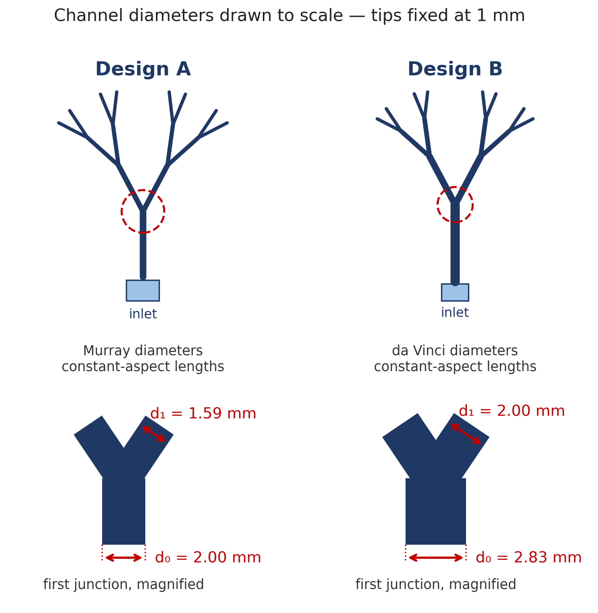
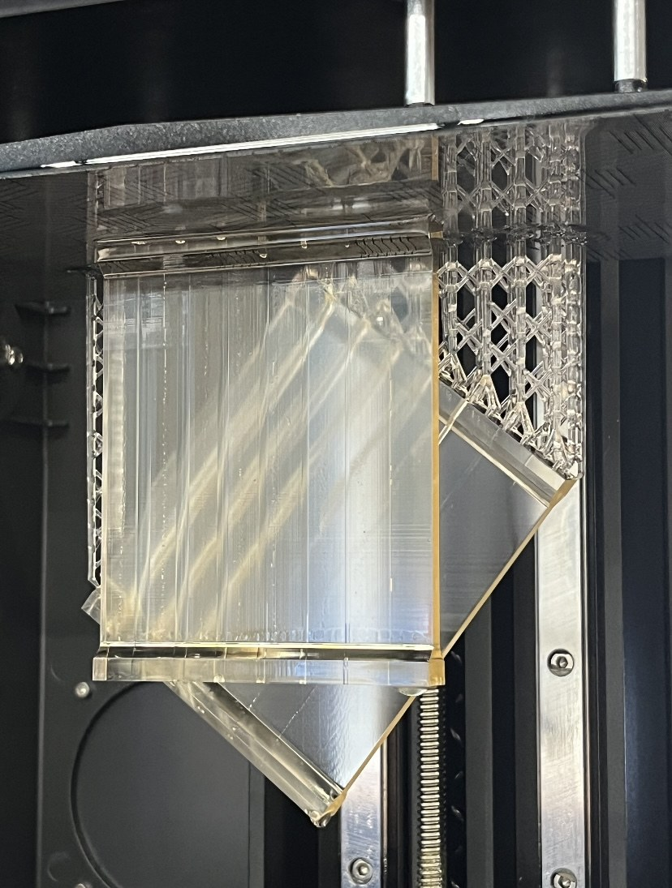
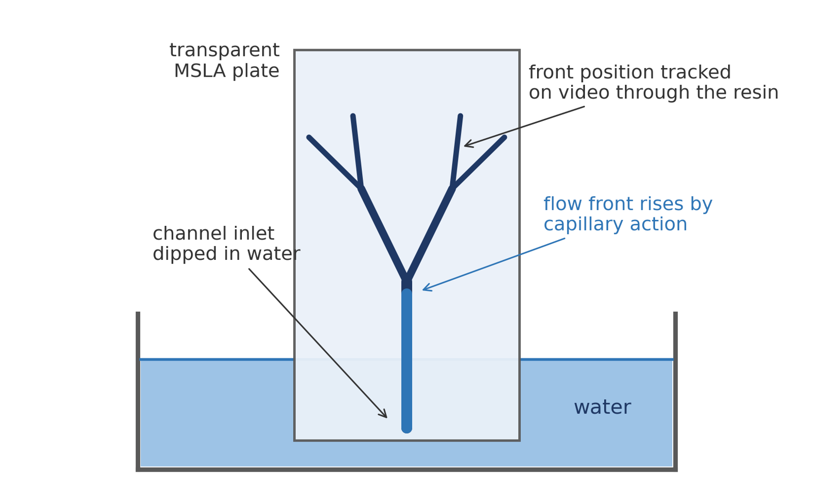
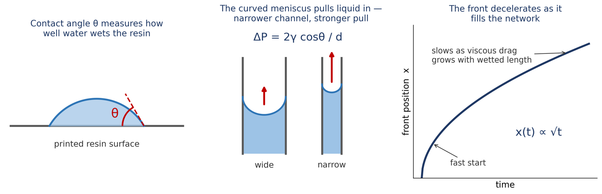

# Additively Manufactured Capillary Wicks

{ width="420" align=right }

**Undergraduate research in the 3DX Research Group (ASU) on printing hair-like and channel structures for passive thermal management.**

Heat pipes and vapor chambers cool electronics by moving heat through a capillary wick with no pump. Additive manufacturing can print wick geometries that conventional fabrication can't, which raises a question nature already answered for trees and blood vessels: does a *branching* network move liquid better than straight channels? My current project tests that directly by printing branching capillary networks designed to different scaling laws and racing water through them.

| | |
|---|---|
| **Role** | Undergraduate researcher; branching-channel project is my own |
| **Advisor** | Dr. Dhruv Bhate, The Polytechnic School, ASU |
| **When** | 2025 – present |
| **Program** | SURF / SCALE (DoD-supported) summer research fellowship, 2026 |
| **Tools** | MSLA printing (Elegoo Saturn 4 Ultra 16K), CAD, optical microscopy (Keyence VHX), video flow tracking |
| **Files** | [SURF-SCALE 2026 poster (PDF)](files/SURF-SCALE-2026-poster-Clonts.pdf) |

## Current project: branching channels for capillary transport

The design question is which rule should set the diameters and lengths of a branching network. Three candidate laws from nature make different predictions:

| Law | Sets | Rule | Origin |
|---|---|---|---|
| **Murray's Law** | diameters | \(d_0^3 = d_1^3 + d_2^3\) | minimizes viscous flow resistance (blood vessels) |
| **da Vinci's rule** | diameters | \(d_0^2 = d_1^2 + d_2^2\) | conserves cross-sectional area (tree branches) |
| **Hack's Law** | lengths | \(L \propto A^{h},\ h \approx 0.586\) | channel length grows with the area it drains (rivers) |

Diameters and lengths are independent choices, so they can be tested separately. Designs A and B share the same lengths and differ only in the area-conservation law; a later design adds Hack's Law length scaling to isolate that variable.

**Fabrication.** Enclosed channels are printed directly into a transparent plate on an MSLA printer with 405 nm resin, with no bonding or assembly. The practical floor is a **1 mm channel diameter**: below that, partially cured resin gets trapped inside the channel during the print. Tips are fixed at 1 mm and the network scales up from there.

**The experiment.** The plate is stood in a water bath and the wetting front is tracked on video through the transparent resin. The governing physics is the capillary pressure \(\Delta P = 2\gamma\cos\theta / d\) against viscous drag, so the front follows roughly \(x(t) \propto \sqrt{t}\): narrower channels pull harder but fill slower.

{ width="720" }

<!-- TODO: embed the single-channel capillary video once the ID is confirmed, e.g.
<iframe width="560" height="315" src="https://www.youtube.com/embed/VIDEO_ID" title="Capillary action test" frameborder="0" allowfullscreen></iframe>
-->

**Status.** Designs A–C are being printed and flow-tested for how much, how fast, and how far they transport water. Next steps are measuring the water–resin contact angle under matched post-cure conditions, sectioning printed channels to check as-built geometry and surface quality, and extending the best topology toward heat-pipe and vapor-chamber wick geometries.

<!-- TODO: add results when you have them — even one plot of front position vs. time for A vs. B turns this from a plan into a finding. -->

## Earlier work in the group

- **Printer selection.** Scoped the smallest hair-like features achievable under a $1,000 equipment budget and selected the Elegoo Saturn 4 Ultra 16K, which became one of the group's two MSLA platforms for this work.
- **Hair-like material fabrication.** Assisted Itzel Chavez Martinez's study of honeybee hair and its reproduction with MSLA printing.
- **Bio-inspired thermal management.** Early investigation of hair as a thermal-regulation structure, including the Saharan silver ant's reflective hair, prior to the shift toward capillary wicks.

## Conference paper

A co-authored paper from the group, *Additive Manufacturing of Hair-like Materials: Design Principles, Process Constraints, and Manufacturing Strategies*, was presented at the **2026 International Solid Freeform Fabrication Symposium** (Austin, TX, August 2026). My contribution was the survey of published AM processes for hair-like materials — feature sizes, build envelopes, and hair geometries across FDM, material jetting, and vat photopolymerization — compiled into the paper's comparison table.
