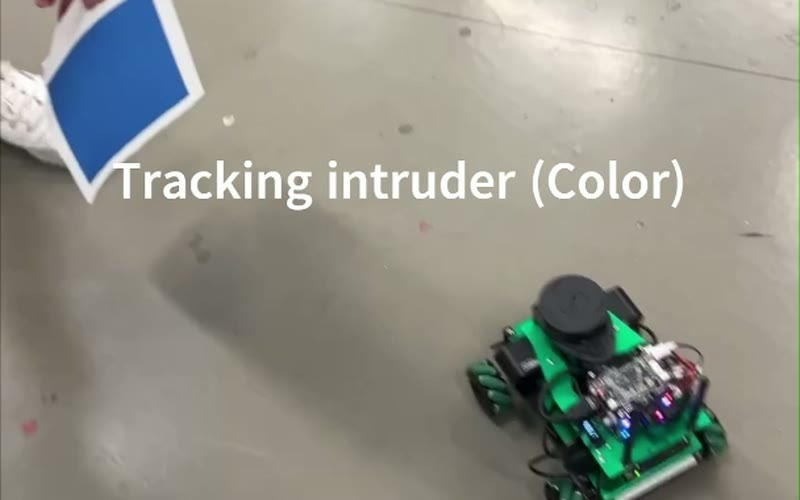
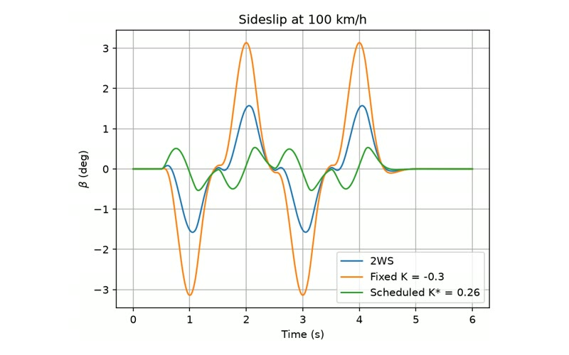

# Projects

Each write-up follows the same shape: what the thing is, what I personally built, the design decisions and why, what the result was, and what I'd change. Design files, firmware, and CAD are downloadable where I'm allowed to share them.

## Case studies

  <a class="project-card" href="wifi-mqtt-board/">
    

    

      Hardware + firmware · Spring 2025 · EGR 314
      <h3 class="project-card__title">ESP32 Wi-Fi / MQTT Gateway Board</h3>
      
Custom PCB and firmware bridging a daisy-chained, multi-board UART network to an MQTT broker over mutually-authenticated TLS. Schematic to working demo in one semester.

      <ul class="tags"><li>Altium</li><li>ESP32-S3</li><li>MicroPython</li><li>Power-rail design</li><li>Protocol design</li></ul>
      Read case study →
    

  </a>
  <a class="project-card" href="capillary-wicks/">
    

    

      Research · Nov 2023 – present · 3DX Research Group
      <h3 class="project-card__title">Additively Manufactured Capillary Wicks</h3>
      
Branching capillary channel networks designed to Murray's Law, da Vinci's rule, and Hack's Law, printed by MSLA and flow-tested for passive heat-pipe wicks. SURF / SCALE 2026 fellowship.

      <ul class="tags"><li>MSLA printing</li><li>Design of experiments</li><li>Microscopy</li><li>Fluid physics</li></ul>
      Read case study →
    

  </a>
  <a class="project-card" href="ros-tracking/">
    

    

      Robotics + vision · Spring 2026 · EGR 530
      <h3 class="project-card__title">ROS Color-Tracking Patrol Robot</h3>
      
Autonomous patrol robot that detects an "intruder" by color, follows it, and returns to its route when it loses it. I owned the OpenCV color-tracking pipeline and false-detection filtering.

      <ul class="tags"><li>ROS</li><li>Python</li><li>OpenCV</li><li>move_base</li><li>State machines</li></ul>
      Read case study →
    

  </a>
  <a class="project-card" href="4ws-vehicle-dynamics/">
    

    

      Controls + modeling · Spring 2026 · EGR 560
      <h3 class="project-card__title">Four-Wheel Steering Vehicle Dynamics</h3>
      
Bicycle-model simulation of rear-wheel steering. The gain that cuts sideslip 70% in town doubles it on the highway; a speed-scheduled gain fixes both.

      <ul class="tags"><li>MATLAB</li><li>Python / SciPy</li><li>State-space modeling</li><li>Vehicle dynamics</li></ul>
      Read case study →
    

  </a>

## Write-ups in progress

  

    Coming soon
    <h3>Industry Capstone</h3>
    
Two-semester senior design prototype for an industry sponsor.

    <ul class="tags"><li>Systems engineering</li><li>Prototyping</li><li>Client requirements</li></ul>
  

  

    Coming soon
    <h3>Microgrid Design in Xendee</h3>
    
Techno-economic design and dispatch modeling of a microgrid.

    <ul class="tags"><li>Xendee</li><li>DER sizing</li><li>Energy economics</li></ul>
  

## Other work

Shorter course and personal projects.

  

    EGR 538 · Batteries &amp; EV Technologies
    <h3>Passive battery management system</h3>
    
Group project designing and testing a passive-balancing BMS for a multi-cell pack.

  

  

    EGR 334 · Analog-Digital Interface · Fall 2025
    <h3>Digital filter design in MATLAB</h3>
    
Designed a Butterworth IIR filter and analyzed its magnitude and phase response, then compared it against the team's Chebyshev design: flat passband versus steeper roll-off.

  

  

    EGR 394 · Electronic Packaging
    <h3>Electronic packaging cross-sections</h3>
    
Cross-sectioned Xbox Series S and One S CPU/GPU and DRAM packages, potted in epoxy, then ground and polished to inspect solder-ball interconnects under a microscope and compare generations.

  

  

    Personal
    <h3>Custom under-desk PC case</h3>
    
Sheet-metal fabrication of a slim PC enclosure.

  

<!-- TODO: link these to short pages or add a photo for each once material is gathered -->
