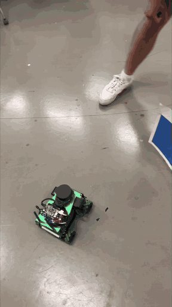
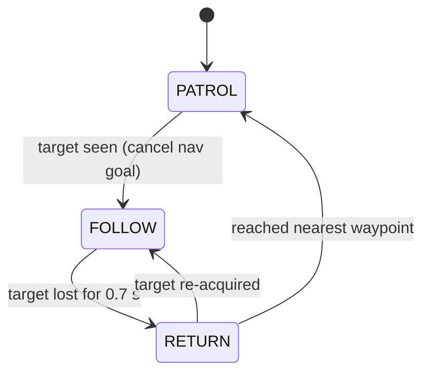

[:material-arrow-left: All projects](../index.md){ .back-link }

# ROS Color-Tracking Patrol Robot

An autonomous patrol robot that spots an "intruder" by color, chases it, and goes back to its patrol when it loses sight of it.

{ width="320" }

Four of us turned a Yahboom ROSMASTER X3 (mecanum base, LiDAR, Orbbec Astra RGB-D camera, Jetson) into a security-style patrol robot for a graduate systems-engineering course. The robot patrols a route, watches its camera feed for a target color, breaks off to follow the target when it appears, and returns to patrol once the target is gone. I owned the color-tracking side: getting detection working on the robot and making it lock onto the right target instead of noise.

| | |
|---|---|
| **Role** | Color-tracking implementation and tuning; minimum-area detection logic; integration debugging |
| **Team** | 4 people (motion control, camera setup / robot ops, system behavior, vision) |
| **When** | Spring 2026 · ASU EGR 530 |
| **Tools** | ROS 1, Python, OpenCV, cv_bridge, `move_base` / actionlib, AMCL, tf |
| **Files** | [ROS package (zip)](files/patrol_color_tracker.zip) |

## The problem

A patrol robot has to do two jobs at once: follow a planned route reliably, and react to something unexpected in its camera view. The hard parts are:

- **Two controllers fighting over the wheels.** The navigation stack (`move_base`) wants to drive to waypoints; the tracker wants to steer directly at the target. Only one can own `/cmd_vel` at a time.
- **False detections.** A raw color threshold fires on reflections, shadows, and small patches of similar color in the background, which sends the robot chasing nothing.
- **Recovering cleanly** to the route after the target disappears.

## What I built

The behavior is one ROS node running a three-state machine at 10 Hz:

- **PATROL:** the node builds a square of four waypoints from the robot's starting pose and sends them to `move_base` one at a time. LiDAR obstacle avoidance comes from the navigation stack.
- **FOLLOW:** cancels the navigation goal and drives `/cmd_vel` directly. A proportional controller on the target's horizontal pixel error steers toward it at a constant 0.12 m/s.
- **RETURN:** heads to the *nearest* patrol waypoint, not the next one in sequence, so the robot doesn't backtrack across the room.

### The vision pipeline (my part)

1. Convert each camera frame from BGR to **HSV**. Hue is much less sensitive to lighting than raw RGB, which matters under fluorescent lab lights and floor glare.
2. Threshold with `cv2.inRange` using a tunable HSV window. In the final demo the target was a blue card.
3. Find external contours and keep the **largest** one.
4. **Minimum-area gate:** reject the blob if it's under 1500 px².
5. Take the blob's centroid from image moments and feed it to the follow controller.

## Key decisions and why

| Decision | Why |
|---|---|
| HSV threshold, not RGB | Hue is far less sensitive to brightness changes than raw RGB, so one threshold works across the room's lighting. |
| Track only the largest contour | Ignores scattered small matches and gives the controller one stable target. |
| **Minimum-area threshold** | Rejects small specks of similar color (reflections, background objects) that would otherwise trigger FOLLOW and send the robot chasing noise. |
| Hand-off between `move_base` and direct `cmd_vel` | Cancelling the nav goal on detection keeps the two controllers from fighting over the motors. |
| Return to the *nearest* waypoint | Shorter, more natural recovery than resuming the sequence where it left off. |
| Everything as ROS params | HSV bounds, gains, and thresholds can be retuned on the robot without editing code. |

## Result

- Real-time color detection and tracking on the robot's onboard computer, with smooth transitions between patrol, follow, and return without manual intervention.
- The square-route patrol worked in testing. Practical complications, including limited space in the demo area, led us to switch the final demo's patrol to **rotating in place** (scan → detect → follow → return), as shown above.
- The minimum-area gate kept the robot from reacting to small false detections.

The robot runs Yahboom's ROSMASTER software stack (camera drivers, navigation, and color-tracking examples). As the course intended, we repurposed those examples into this behavior. The download above contains only our integration node and configuration.

## What I'd change

1. **Use the depth camera.** The Astra is RGB-D. Using depth to the blob would let the robot hold a set following distance instead of driving at constant speed.
2. **Make detection robust to lighting:** adaptive HSV thresholds, or a small learned detector on the Jetson in place of a fixed color window.
3. **Require N consecutive detections** before entering FOLLOW, to suppress single-frame flickers.
4. **PD or pure-pursuit control** on the target's estimated map position instead of P-only on pixel error.
5. **Port to ROS 2** with a proper behavior tree and unit tests for the detection function.
