# ESP32 Wi-Fi / MQTT Gateway Board

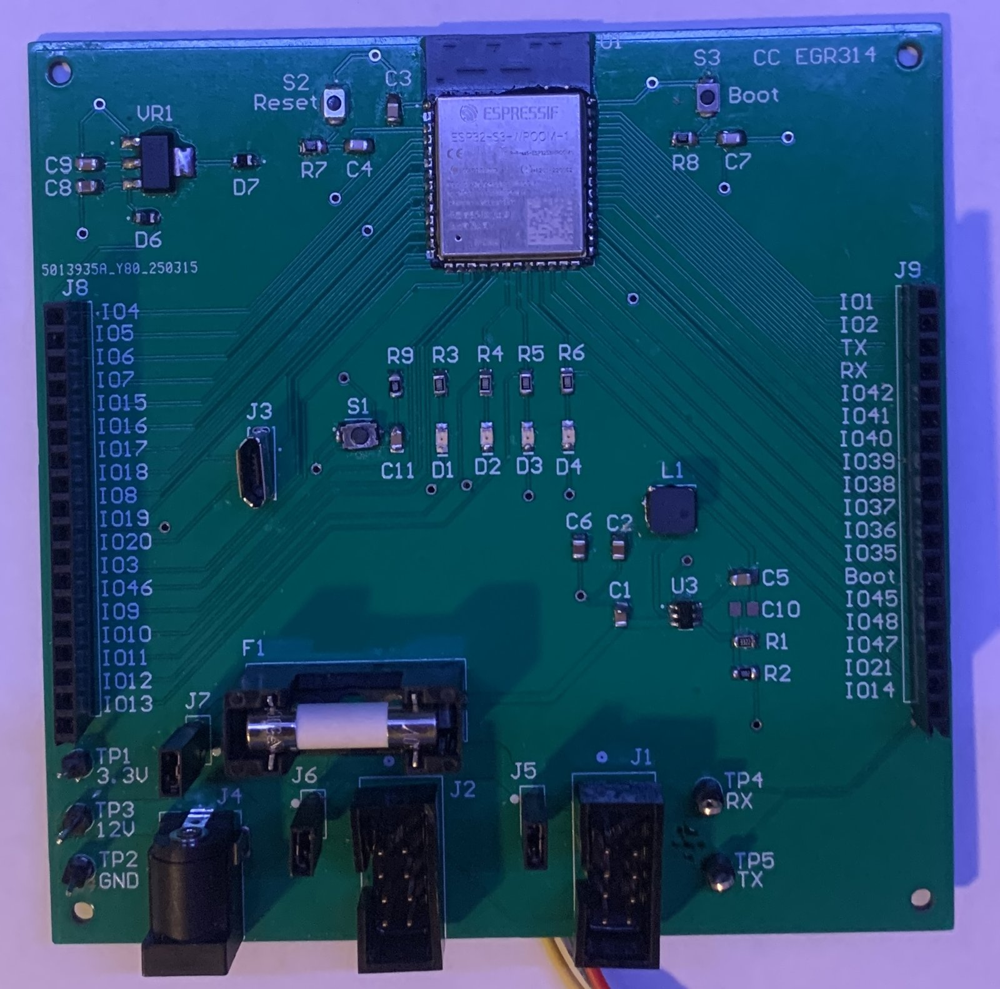{ width="560" }

<div class="grid" markdown>

<div markdown>

**A custom PCB and firmware that bridges a chain of embedded boards to the internet.**

Three of us built a networked cooling-system demo for the ASU Innovation Showcase: a temperature sensor drives a fan through a chain of independent boards, and the whole thing can be monitored and controlled from a web dashboard. I owned the internet side of that — the board that talks to the MQTT broker, the wire protocol the boards use to talk to each other, and the firmware that moves messages between the two.

The board went from schematic to fabricated, assembled, and running at the showcase in one semester.

</div>

<div markdown>

| | |
|---|---|
| **Role** | Sole designer of this board: schematic, layout, BOM, firmware, enclosure |
| **Team** | 3 people, one board each (HMI, actuator, gateway) |
| **When** | Spring 2025 · ASU EGR 314 |
| **Tools** | Altium Designer, MicroPython, ESP32-S3, CAD for enclosure *(TODO: which CAD tool / which fab house?)* |
| **Files** | [Altium project](files/altium-project.zip) · [Gerbers](files/gerber-files-cc-v1.2.zip) · [Schematic PDF](files/altium-schematic.pdf) · [Firmware](files/esp32_mqtt_Rev2.3.zip) |

</div>

</div>

## System overview

The demo is a small distributed system. Each board is a self-contained ESP32 node with its own function, and they're wired in a UART daisy chain: every board receives on one port, transmits on the other, and forwards anything that isn't addressed to it. My gateway board sits at the head of the chain and is the only node with Wi-Fi.

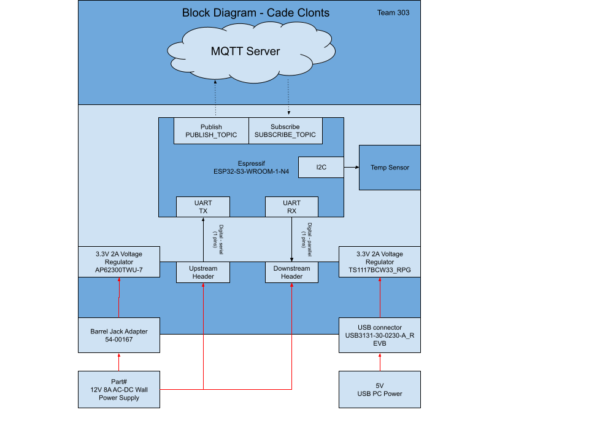{ width="640" }

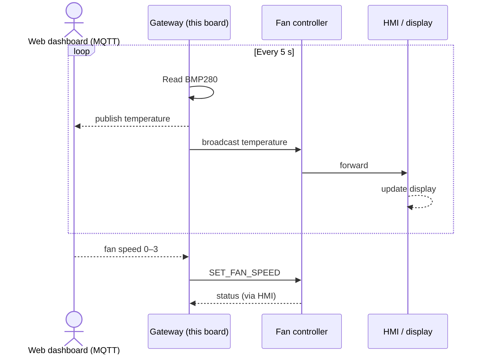

## Hardware

### Power

The board accepts two power inputs and regulates both to 3.3 V:

- **12 V / 8 A barrel jack** → AP62300 synchronous buck (4.2–18 V in, 3 A out). This is the main rail and also passes 12 V through to a header for the fan board downstream.
- **5 V USB** → TS1117 LDO. Lets the board run and program from a laptop with nothing else plugged in.

I built a power budget from the datasheet maximums of every load on the 3.3 V rail, then added a 25 % margin: **901 mA → 1.13 A required**, comfortably inside the buck's 3 A rating. A 2 A fuse on the 12 V input protects the harness.

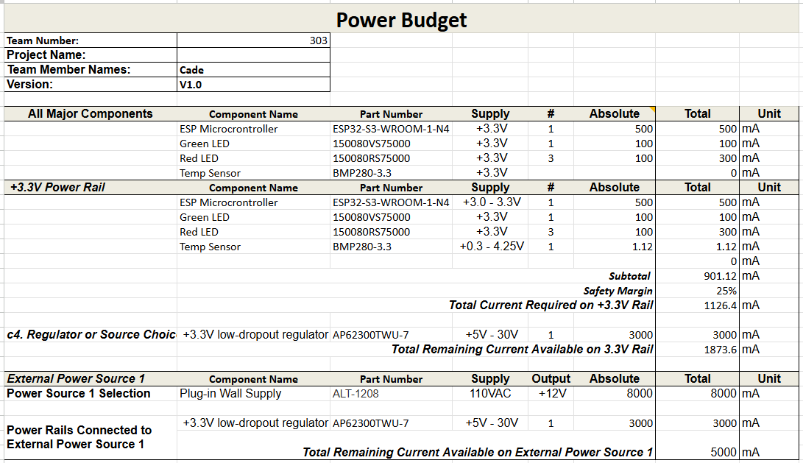{ width="640" }

### Layout

Design choices that mattered on the bench:

- **Every unused ESP32-S3 GPIO broken out** to labeled 0.1" headers on both edges, so the board doubles as a dev platform.
- **Five test points** (3.3 V, 12 V, GND, TX, RX) for scope probing without fighting for pad access.
- **Four debug LEDs** on GPIO, plus a debug pushbutton, so message flow is visible without a serial console.
- **Reset and Boot switches** so firmware can be reflashed without touching jumpers.
- **Module antenna hangs off the board edge** so there's no copper under it. *(TODO: confirm this was intentional — if so, keep; otherwise delete.)*

<div class="grid" markdown>

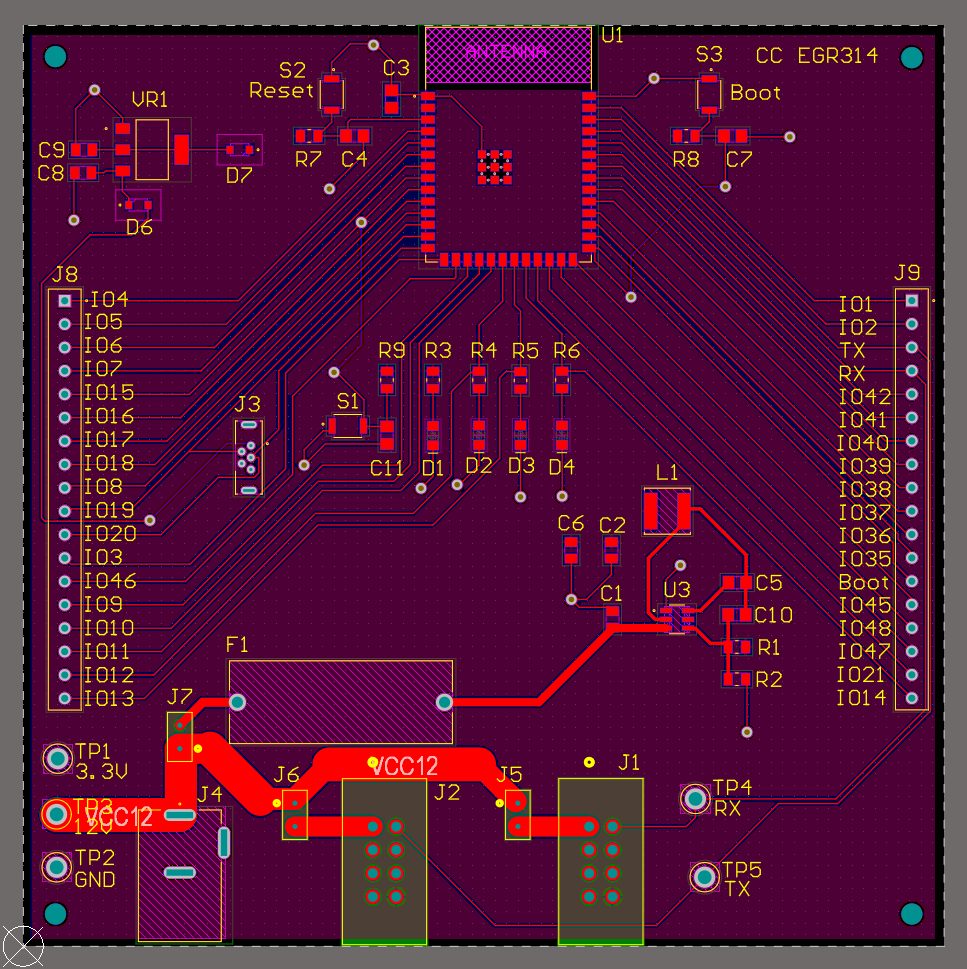

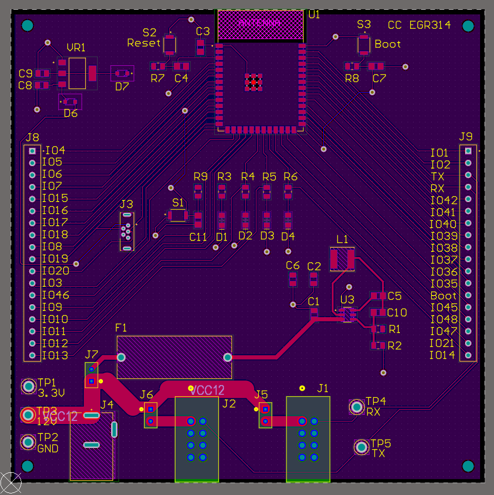

</div>

<div class="grid" markdown>

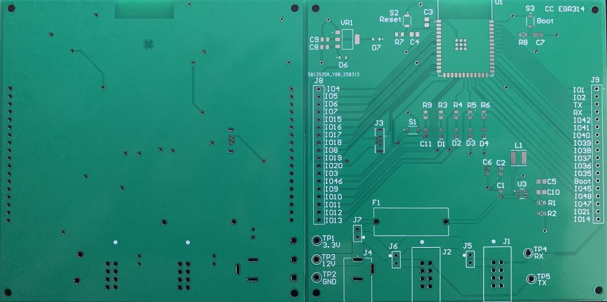

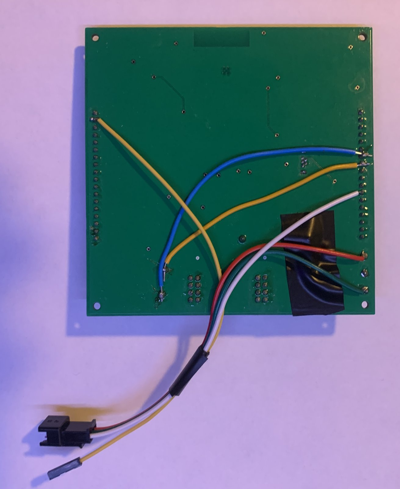

</div>

### Component selection

I ran a short trade study for each major part. The two that drove the design:

| Part | Picked | Over | Why |
|---|---|---|---|
| MCU | ESP32-S3-WROOM-1-N4 | S3-N16R8, WROOM-32E | Wi-Fi + BLE, native USB programming, castellated SMT module, $2.95 and in stock. Extra RAM in the N16R8 wasn't needed. |
| Main regulator | AP62300 buck | TPS75133, NCP5662, NCP565 | Only candidate with a wide-enough input range (12 V) *and* good efficiency; the LDO options either couldn't take 12 V in or would have dissipated too much heat at the required current. |

Full BOM with vendor and datasheet links: [bom.xlsx](files/bom.xlsx).

<details markdown>
<summary>Schematic</summary>

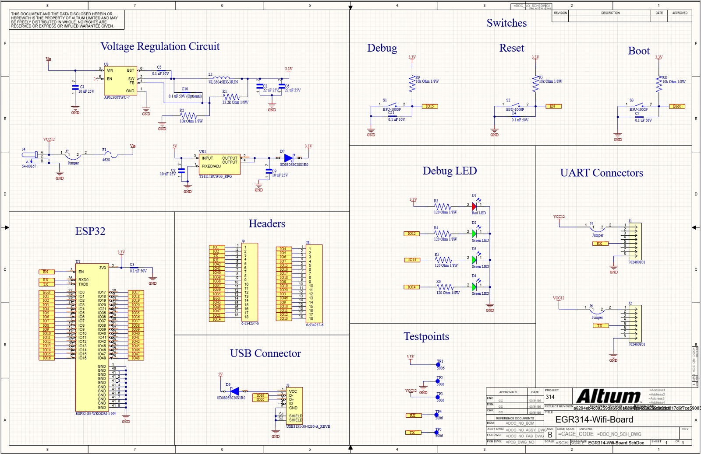

[Schematic PDF](files/altium-schematic.pdf) · [PCB PDF](files/PCB-design.pdf)

</details>

## Protocol design

The boards needed a way to pass messages down a chain where any node might be missing or unresponsive. I designed a fixed-length framed protocol so a node can resynchronize on the byte stream at any time:

```
Byte  0–1   "AZ"          frame start
Byte  2     source_id     0x01 gateway, 0x02 HMI, 0x03 fan
Byte  3     dest_id       node ID, or 0x58 = broadcast
Byte  4     message_type  0x10 temperature, 0x20 fan control
Byte  5–8   payload       (type-specific)
Byte  9–61  reserved
Byte 62–63  "YB"          frame end
```

Rules every node follows:

- Frames are always **64 bytes**. A receiver scans for `AZ`, collects 64 bytes, and checks for `YB`; anything malformed or oversized is dropped and the scan restarts.
- If `dest_id` is you, handle it. If it's broadcast, handle it **and** forward it. If it's someone else, forward it unchanged.
- Never forward your own messages — this is what stops broadcasts from circulating forever around the ring.

The gateway also publishes fan-speed changes to a dedicated MQTT topic so the dashboard reflects the real state of the fan rather than the last command sent.

## Firmware

MicroPython on the ESP32-S3, built on the `mqtt_as` async client. Everything runs as cooperative `uasyncio` tasks so a slow Wi-Fi reconnect never blocks the UART receiver:

- `process_rx()` — byte-by-byte UART frame parser (the state machine described above)
- `read_temperature_and_publish()` — samples the BMP280 over I2C every 5 s, publishes to MQTT, broadcasts on the chain, and sends a fan-speed command only when the threshold state changes
- `sub_cb()` — MQTT subscription callback that translates a dashboard command into a fan-control frame
- `check_debug_button()` / `heartbeat()` — bench diagnostics

The MQTT connection is **TLS with mutual authentication**: client certificate, private key, and CA cert loaded from flash, server hostname verified.

[Download firmware (Rev 2.3)](files/esp32_mqtt_Rev2.3.zip){ .md-button }

## Enclosure and demo fixture

I modeled a two-piece enclosure for the board and the stands for the fan, heat lamp, and temperature probe used in the demo, all FDM-printed.

<div class="grid" markdown>

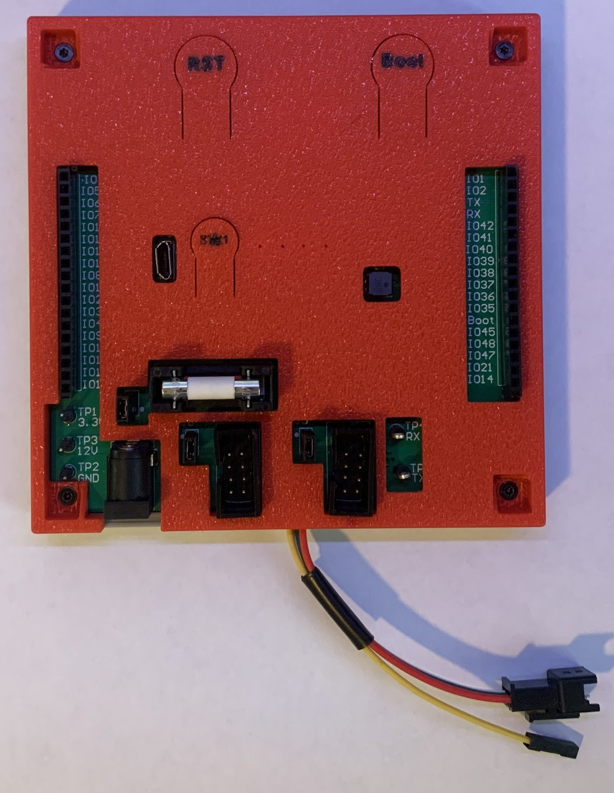

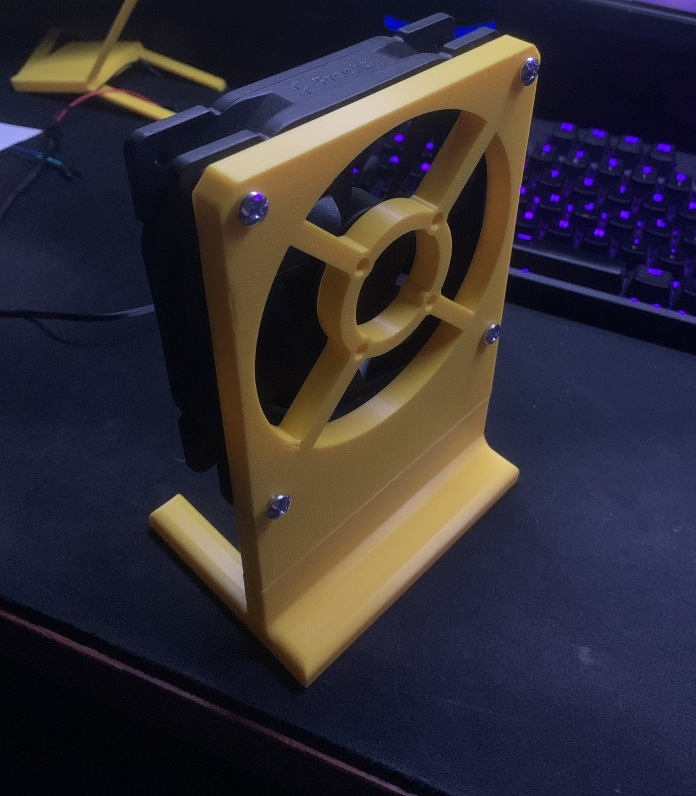

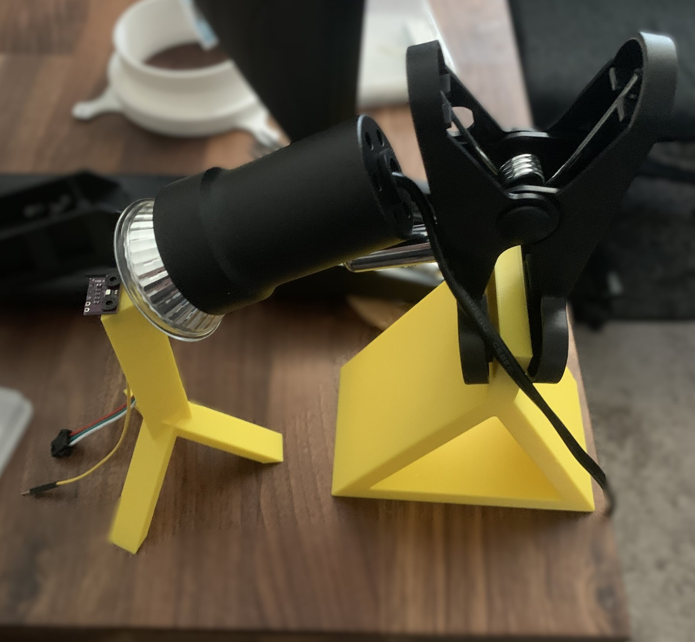

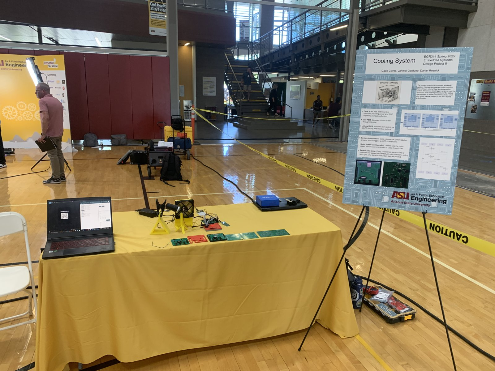

</div>

STEP files: [board case (top)](files/step/top-board-case.step) · [board case (bottom)](files/step/lower-board-case.step) · [PCB](files/step/EGR314-wifi-board.step) · [fan stand upper](files/step/fan_upper_stand.step) · [fan stand lower](files/step/fan_lower_stand.step) · [heat lamp stand](files/step/heat_lamp_stand.step) · [temperature stand](files/step/temperature_stand.step)

## Result

The chain ran end-to-end at the Innovation Showcase on May 2, 2025, with live temperature on the web dashboard and remote fan control.

*(TODO — this is the section recruiters read. Add: did the board work on the first spin or need rework? Any measured numbers — rail voltage under load, message latency, uptime during the demo? One honest sentence about what broke and how you fixed it is worth more than a paragraph of "it worked.")*

## What I'd change in Rev 2

Things I found once the board was in use, all of which are cheap fixes on the next spin:

1. **Move UART to GPIO 17/18.** The pins I used work, but 17/18 are the conventional pair for the S3 and avoid conflicts with other peripherals.
2. **Reverse-polarity protection on the 12 V input.** A Schottky or ideal-diode controller after the barrel jack. The fuse protects against overcurrent, not a swapped supply.
3. **A USB-power isolation jumper.** When the board is in a chain with other USB-powered boards, being able to cut the 5 V path prevents back-powering.
4. **Dedicated 3.3 V / 12 V / GND power headers**, clearly labeled, instead of borrowing from test points during bench work.
